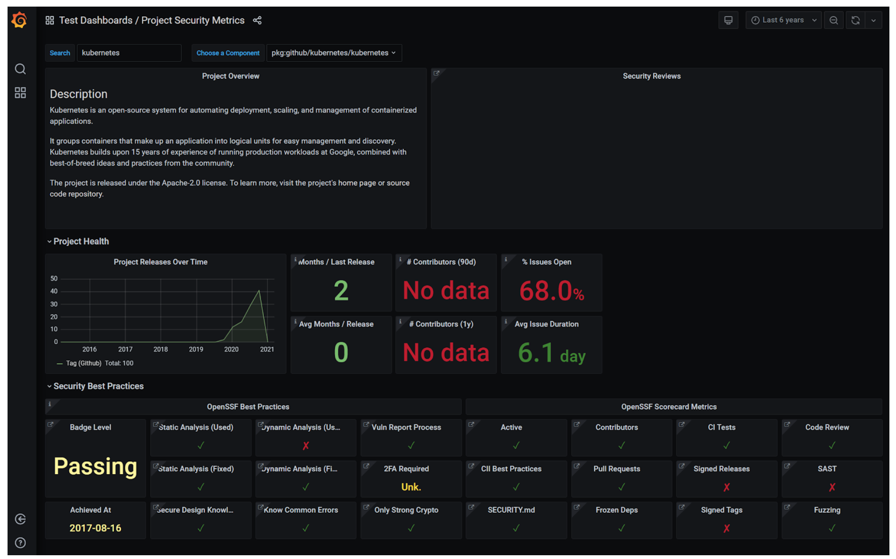

# **2021-03-09 Meeting**

## Attendance (please add yourself):

* Carly Driggers (Linux Foundation)
* Dan Middleton (intel)
* Phil Estes (AWS)
* Vinod Anandan (Citi)
* Maya Kaczorowski (GitHub)
* Xavier Rene-Corail (GitHub)
* David A. Wheeler (Linux Foundation)
* Matt Rutkowski (IBM)
* CRob (Red Hat)
* Jennifer Fernick (NCC Group)
* Kay Williams (Microsoft) 
* Rao Lakkakula (JPM chase)
* Ryan Haning (Microsoft)
* Michael Scovetta (Microsoft)
* Luke Hinds (Red Hat)

## Agenda:

* Working Group Reviews

<table>
  <tr>
   <td>
<strong>Working Group</strong>
   </td>
   <td><strong>Description</strong>
   </td>
   <td><strong>Related Projects/Comments</strong>
   </td>
  </tr>
  <tr>
   <td>Best Practices (<a href="https://github.com/ossf/wg-best-practices-os-developers">repo</a>)
   </td>
   <td>The Best Practices for OSS Developers working group is dedicated to raising awareness and education of secure code best practices for open source developers.
   </td>
   <td>Subprojects:
<ul>

<li>CRE - connects up various requirements sets (800-53, etc.)

<li>edX Secure Software Development Fundamentals course

<li>OWASP SKF

<li>CII Best Practices badge project

<li>Scorecards (automates analysis of a project)

Note: CII Best Practices badge & scorecards info is used by the metrics dashboard of the Security Threats WG.

Have identified a set of personas to help id pain points.

Todo: SKF - would like some computing infrastructure (currently some RPi’s), we need to figure out the details.
</li>
</ul>
   </td>
  </tr>
  <tr>
   <td>Vulnerability Disclosure (<a href="https://github.com/ossf/wg-vulnerability-disclosures">repo</a>)
   </td>
   <td>The OpenSSF Vulnerability Disclosures Working Group seeks to help improve the overall security of the open source software ecosystem by helping mature and advocate well-managed vulnerability reporting and communication.
   </td>
   <td>
<ul>

<li>Document “reasonable activities” of OSS developers (many participants also interested in finder persona)

<li>Document “pain points” (as Google docs)

<li>Facilitate exchange of vulnerability data. E.g., CERT/CC, OVAL, CVRF, etc. Discussed DWF (frenemy of CVE)

<li>First deliverable: Vulnerability disclosure white paper - frame problem & provide recommendations. Goal early/mid summer
Had hoped the group would be more interested in <a href="https://www.kb.cert.org/vince/">VINCE</a> & related tooling, only a few currently are (problem: VINCE isn’t OSS, so most people aren’t interested; maybe the OpenSSF can help CERT do that release).

Want to make things easier, e.g., provide generic policies, fill in reports, simple templates, “how to get a CVE”, etc.
</li>
</ul>
   </td>
  </tr>
  <tr>
   <td>Identifying Security Threats (<a href="https://github.com/ossf/wg-identifying-security-threats">repo</a>)
   </td>
   <td>About

The purpose of the Identifying Security Threats working group is to enable stakeholders to have informed confidence in the security of open source projects. We do this by collecting, curating, and communicating relevant metrics and metadata from open source projects and the ecosystems of which they are a part.
   </td>
   <td>Subprojects:
<ul>

<li><a href="https://github.com/ossf/wg-identifying-security-threats/tree/main/publications/threats-risks-mitigations">Threats paper</a> (todo: Add more on dependency confusion, other improvements)

<li><a href="https://github.com/ossf/Project-Security-Metrics">Project-Security-Metrics</a> (metrics dashboard) 
<ul>
 
<li><a href="http://openssf-security-dashboard-dev1.westus2.cloudapp.azure.com/">live PoC site</a> (v2)
 
<li>Currently running employee gratis, need to move
</li> 
</ul>

<li><a href="https://github.com/oss/security-reviews">Security-reviews</a> 
<ul>
 
<li>Community curated collection of security reviews (often by linking to them). We already have several. Method/scope not prescribed, but must say what it is.
 
<li>NOT a 0-day vulnerability disclosure mechanism
 
<li>blog

Issue: How do we improve the metrics dashboard hosting (not just Michael’s site)?
</li> 
</ul>
</li> 
</ul>
   </td>
  </tr>
</table>

## Minutes:

* Maya Kaczorowski (GitHub) announces she will be withdrawing.

Metric Dashboard screenshot:

