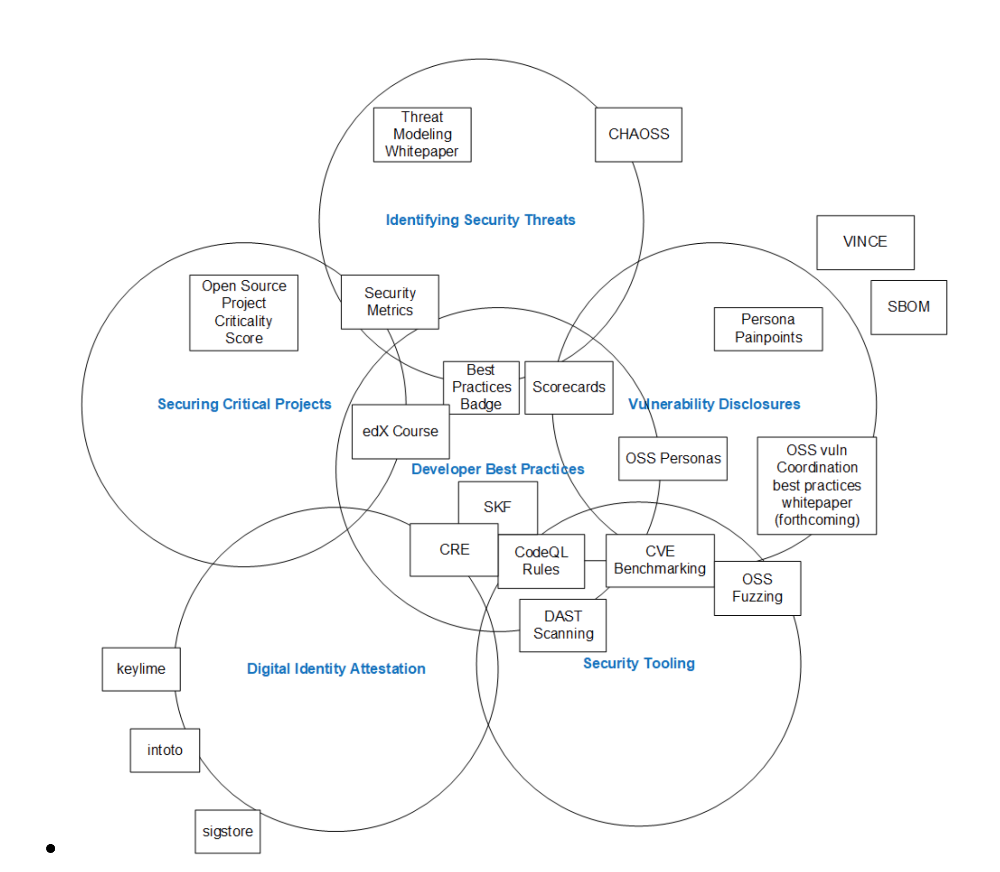

# **2021-08-10 Meeting**

## Attendance (please add yourself):

* Ax Sharma (Sonatype)
* CRob (Intel)
* Kay Williams (Microsoft)
* David A. Wheeler (LF)
* Dan Lorenc (Google)
* Jennifer Fernick (NCC Group)
* Rao Lakkakula - (JPMC)
* Sal Kimmich (Sonatype) 
* Matt Rutkowski (IBM)

## Agenda:

* OpenSSF 2021 Budget Approved (Kay)
    * Identifying Security Threats WG - $40K development + $1,600 Azure Credits
    * Best Practices WG - $33,100 development + $30K Azure Credits
    * Securing Critical Projects WG - OSTIF Proposal - $60K
    * There’s about $65K left
* OpenSSF [Allstar](https://github.com/ossf/allstar) [GitHub app](https://docs.github.com/en/developers/apps/getting-started-with-apps/about-apps#about-github-apps) (Securing Critical Projects WG)
    * Sets some GitHub security policies, e.g., must have SECURITY.md, etc. It is related to ScoreCards - enforces some of the same things. The name is a play on “scorecard” - if you get a good score you’re an all-star.
    * Announcement - blog, email, tweet - coming soon!
* Discuss - OpenSSF response to US Whitehouse EO (Kay)
    * fyi - [video for Planning Committee Meeting](https://zoom.us/rec/play/RTdp5X7H067xonXhpirp12adiQsDaB47_V6xFsZDhHT9tOoIU4J7zHX_h1cWFrOdJ7Z64rfc5hu0W7Qu.iDdcgUC2cLd2ctzJ?canPlayFromShare=true&from=share_recording_detail&continueMode=true&componentName=rec-play&originRequestUrl=https%3A%2F%2Fzoom.us%2Frec%2Fshare%2FrtLFGJwiV9a6lyMscgUfnE2bwbzma7vvB6xQyoZysDvXidj0rYUEMh4bvmcxZgXm.zpJTqfFT0HLunFxr) (8/9)
        * There’s little time before the next NIST response is due. The Planning Committee won’t try to coordinate a response in that little time, but we’ll share information as individuals prepare their own responses (as individuals choose)
    * Identify EO-Critical OSS Projects
        * Securing Critical Projects WG
    * Generate evidence demonstrating conformance to EO requirements
        * Security Best Practices WG / Identifying Security Threats WG?
* Questions
    * CRoB: Best Practices WG is trying to create more prescriptive guidance on what developers should do; needs to synergize with tools WG. Would it be better to approach this as a collective project of the OpenSSF as a whole?
        * Suggestion: follow publishing immediately with a poll to ask what else readers would like to see
        * Suggestion: make this a living document
        * CRoB to send out email
    * CRoB: OpenSSF Reference Architecture (project for Black Hat)
        * Shows interactions between groups and projects.
        * David: Suggest paper with diagram
        * CRoB: Dynamic graphic allows clicking to repositories with readme for people to learn how to get involved.
        * Sal: Make sure people can find points of contact
        * Jennifer: Mark things that are collaboration across projects, consider color coding
        * David: Make them all hyperlinks - then people can quickly get to the info. There are nits that I think need to be fixed (need to make overlaps bigger to fit info & CHAOSS should be partly outside since it’s really an external project), but I love the approach.
        * Next Steps:
            * CRoB to move diagram to editable format, share with others.
            

