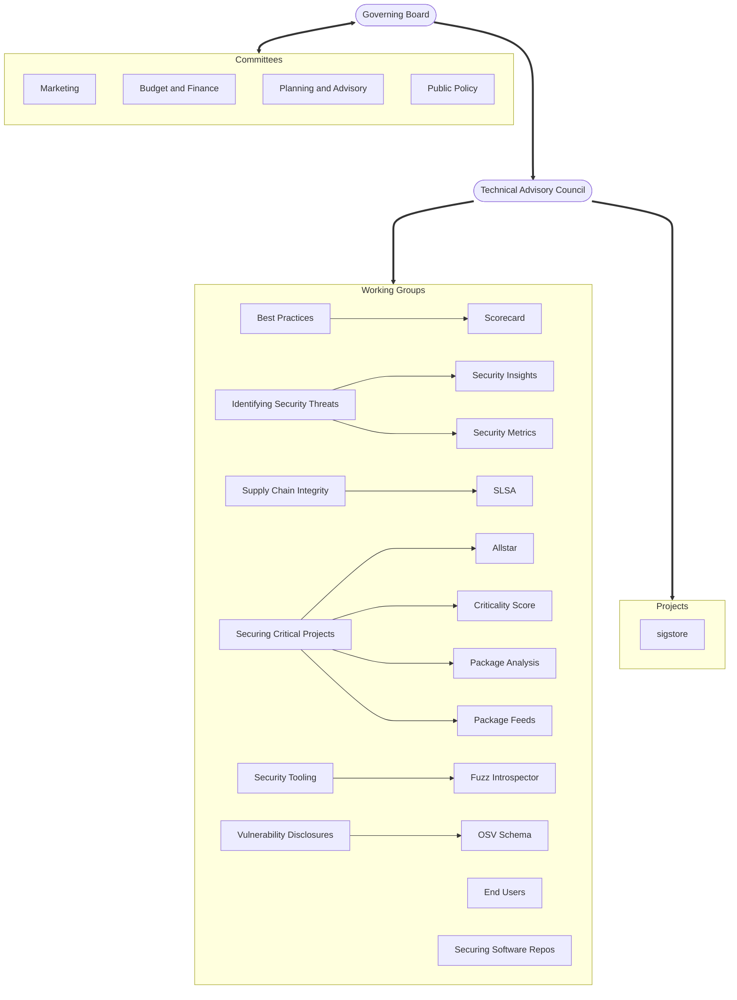

# OpenSSF Governance & Org Structure

## OpenSSF Charter

The overall governance of the OpenSSF is defined in [the OpenSSF Charter](https://openssf.org/about/charter/). 

## Definitions

The OpenSSF is comprised of instances of the following categories of official groups:

- The **Governing Board** (GB) oversees the budget and legal status/structure of the OpenSSF. Board meetings may or may not be open to the public.
- **Committees** are formed by, and report to, the Board. Broadly speaking, Committees handle non-technical matters as needed by the GB, wherein a named set of people are tasked with handling a specific objective. Like the Board meetings, Committee meetings may or may not be open to the public.
- The **Technical Advisory Council** (TAC) is responsible for the general success of all Technical Initiatives (defined below). TAC meetings are generally open to the public, with the exception of special sessions.
- **Technical Initiatives** are groups formed in support of the overall mission of the OpenSSF. Technical Initiatives include Working Groups (WG), Special Interest Groups (SIG), Projects, and Services governed by their own Charters with various objectives, reporting relationships, and funding models described below.
   - All Technical Initiatives are open groups focused on a technical objective, with transparent proceedings that are open to the public, and vary in their objectives.
   - Technical Initiatives usually manage one or more GitHub repos of their own and may have separate meetings.
- **Working Groups** (WG) are the primary organizational element of Technical Initiatives within the OpenSSF. Working Groups focus on developing deliverables such as guides, specifications, and educational material, or conducting initiatives such as an education outreach.
   - While a WG does not produce open source software as a primary artifact, it may oversee Projects that do.
   - A WG may also launch Special Interest Groups (SIG) to perform specific tasks other than creating software.
   - WGs often include some open source code, or use licensed software, in fulfilment of their Charter.
- A **Project** is a Technical Initiative focused on the development and ongoing support of open source licensed software (source code) and its supporting artifacts (technical documentation, etc.).
- **Special Interest Groups** (SIG) are under the direct governance of their reporting WGs and are bound to achieving a very specific goal. These groups may be terminated upon completion of their designating tasking, continued for larger and ongoing efforts, or otherwise subject to the governance, structure, and termination policies of the WG they are under. The creation of a SIG must dictate the focus, intent, goals, and deliverable(s) as appropriate.
- A **Technical Deliverable** is any technical content produced by a Technical Initiative, such as open source licensed software, a specification, or a technical guide.
   - Each **Project** shall have at least one Technical Deliverable including open source licensed software; this is what defines a Project as distinct from other Technical Initiatives such as SIGs.
   - A **Service** is a publicly-run instance of software as a service, and is another form of Technical Deliverable distinct from the release of open source licensed software. This may be an operational output of a Technical Initiative in which software is either built or acquired to support or automate OSSF transactions.

The following table describes the main types of groups and their characteristics.

| Initiative | Expected lifespan | Primary output| Reporting relationship |	Economic model
|------------|-------------------|---------------|------------------------|---------------
| Working Group (WG) | unbounded | not software | to the TAC | normative
| Project |	unbounded | software | either TAC or WG | normative
| Special Interest Group (WG) | bounded | not software | to a WG | normative

### TODO

* define and document the governance relationships for affiliated projects: Alpha/Omega, GNU Toolchain Infrastructure 
* define **Contributors** in a consistent way, so that electorate membership can be consistently, and ideally procedurally, determined
* define criteria for approving or disapproving the Charters of TAC-subordinate bodies

## Organizational Chart

Legend:
- rounded box: entity is created by the OpenSSF governing charter
- square box: entity is created by the relevant body
- logical groupings are by convention rather than by charter

