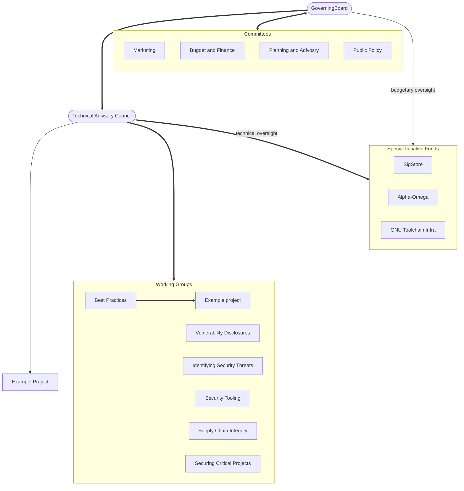

# OpenSSF Governance & Org Structure

## Charter

Overall governance of the OpenSSF is defined in [the Foundation Charter](https://cdn.platform.linuxfoundation.org/agreements/openssf.pdf). 

## Definitions

The OpenSSF is comprised of instances of the following categories of official groups:

- The **Governing Board** (GB) oversees the budget and legal status/structure of the OpenSSF. Board meetings may or may not be open to the public.
- **Committees** are formed by, and report to, the Board. Broadly speaking, Committees handle non-technical matters as needed by the GB, wherein a named set of people are tasked with handling a specific objective. Like the Board meetings, Committee meetings may or may not be open to the public.
- The **Technical Advisory Council** (TAC) is responsible for the general success of all Technical Initiatives (defined below). TAC meetings are generally open to the public, with the exception of special sessions. 
  - TAC membership is limited to seven (7) seats, with alternating elections every year. Contributors to Technical Initiatves may run, and each contributor may vote once in TAC elections. 
- **Technical Initiatives** are projects, working groups (WG), or services governed by their own Charters. Charters are approved by the TAC. Once approved, changes to a Charter must be reviewed, evaluated, and accepted or rejected according to terms documented in the Charter. If accepted, changes to a Charter are then sent for approval or disapproval by the TAC.
   - All Technical Initiatives are persistent open groups focused on a technical objective, with transparent proceedings that are open to the public, and vary in their objectives.
- A **Project** is a Technical Initiative focused on the creation and ongoing support of resulting Technical Deliverables. Projects usually manage one or more GitHub repos of their own, may have separate meetings, etc.  **(what is the etc?)**
   - A **Technical Deliverable** is an open source licensed software (source code) and its supporting artifacts (technical documentation, etc.) produced from a project. 
- A **Working Group** (WG) is a group (or team) based Technical Initiative formed to support the overall mission of the OpenSSF. WGs generally do not produce open source software as a primary artifact. WGs often include some open source code, or use licensed software, in fulfillment of their Charter. WGs can be formed to perform tasks Temporary or Ongoing in scope.
  - **Temporary** scope -- The WGs charter may specify that the WG will wrap up after a specific event, such as a publication.
  - **Ongoing** scope -- The WGs charter may specify that an effort is expected to be ongoing in support of open source security indefinitely.
- A **Service** is a Technical Initiative in which software is either built or acquired to support or automate OSSF transactions
  

### TODO

* define **SIF** 
* define **Contributors**
* criteria for approving or disapproving a Charter (if not already here)

## Ogranizational Chart

Legend:
- rounded box: entity is created by the OpenSSF governing charter
- square box: entity is created by the relevant body
- logical groupings are by convention rather than by charter

