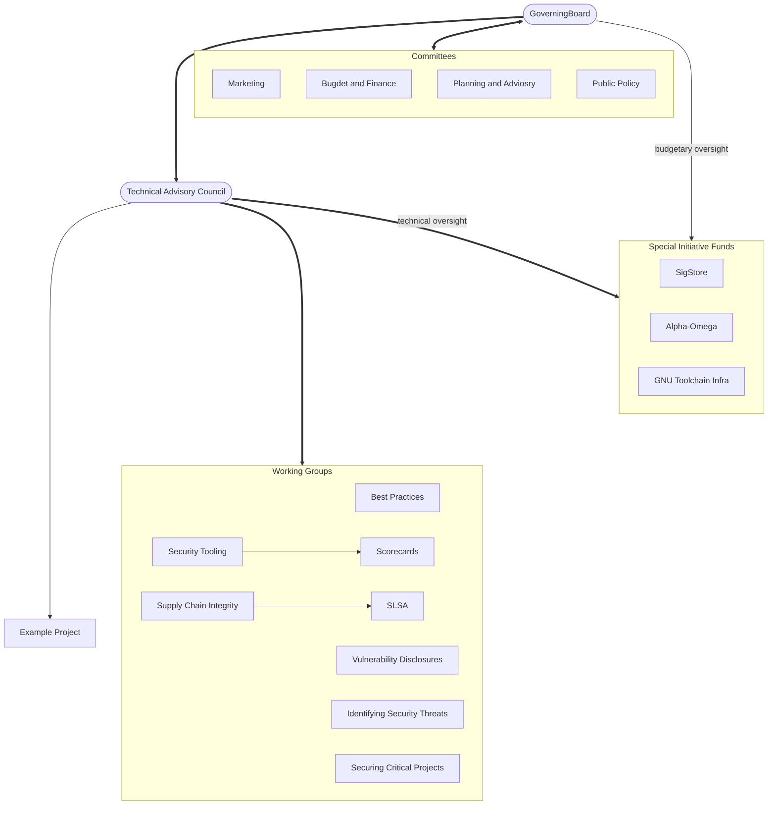

# OpenSSF Governance & Org Structure

## OpenSSF Charter

The overall governance of the OpenSSF is defined in [the Foundation Charter](https://cdn.platform.linuxfoundation.org/agreements/openssf.pdf) (PDF file). 

## Definitions

The OpenSSF is comprised of instances of the following categories of official groups:

- The **Governing Board** (GB) oversees the budget and legal status/structure of the OpenSSF. Board meetings may or may not be open to the public.
- **Committees** are formed by, and report to, the Board. Broadly speaking, Committees handle non-technical matters as needed by the GB, wherein a named set of people are tasked with handling a specific objective. Like the Board meetings, Committee meetings may or may not be open to the public.
- The **Technical Advisory Council** (TAC) is responsible for the general success of all Technical Initiatives (defined below). TAC meetings are generally open to the public, with the exception of special sessions. 
- **Technical Initiatives** are groups formed in support of the overall mission of the OpenSSF. Technical Initiatives include Working Groups (WG), Special Interest Groups (SIG), Projects, and services governed by their own Charters with various objectives, reporting relationships, and funding models described below.
   - All Technical Initiatives are open groups focused on a technical objective, with transparent proceedings that are open to the public, and vary in their objectives.
   - Technical Initiatives usually manage one or more GitHub repos of their own and may have separate meetings.
- A **Project** is a Technical Initiative focused on the development and ongoing support of open source licensed software (source code) and its supporting artifacts (technical documentation, etc.).
- A **Working Group** (WG) focuses on developing other types of deliverables than software such as guides, specifications, and educational material, or conducting initiatives such as an education outreach. While a WG does not produce open source software as a primary artifact it may launch Projects that do so. A WG may also launch Special Interest Groups (SIG) to perform specific tasks. WGs often include some open source code, or use licensed software, in fulfilment of their Charter.
- **Special Interest Groups** (SIG) are under the direct governance of their reporting WGs and are bound to achieving a very specific goal. 
- A **Technical Deliverable** can be an open source licensed software and its supporting artifacts, a specification, or a technical guide. This is a technical artifact produced by a Technical Initiative.
- A **Service** is a Technical Initiative in which software is either built or acquired to support or automate OSSF transactions.

The following table describes the main types of groups and their characteristics.

| Initiative | Expected lifespan | Primary output| Reporting relationship |	Economic model
|------------|-------------------|---------------|------------------------|---------------
| Working Group (WG) | unbounded | not software | to the TAC | normative
| WG w/ SIF | unbounded | not software | to the TAC | special fund
| Project |	unbounded | software | either TAC or WG | normative
| Project w/ SIF | unbounded | software (or service) | to the TAC | special fund
| Special Interest Group (WG) | bounded | not software | to a WG | normative

SIF = Specific Initiative Fund

### TODO

* define **SIF** 
* define **Contributors**
* criteria for approving or disapproving a Charter (if not already here)

## Organizational Chart

Legend:
- rounded box: entity is created by the OpenSSF governing charter
- square box: entity is created by the relevant body
- logical groupings are by convention rather than by charter

