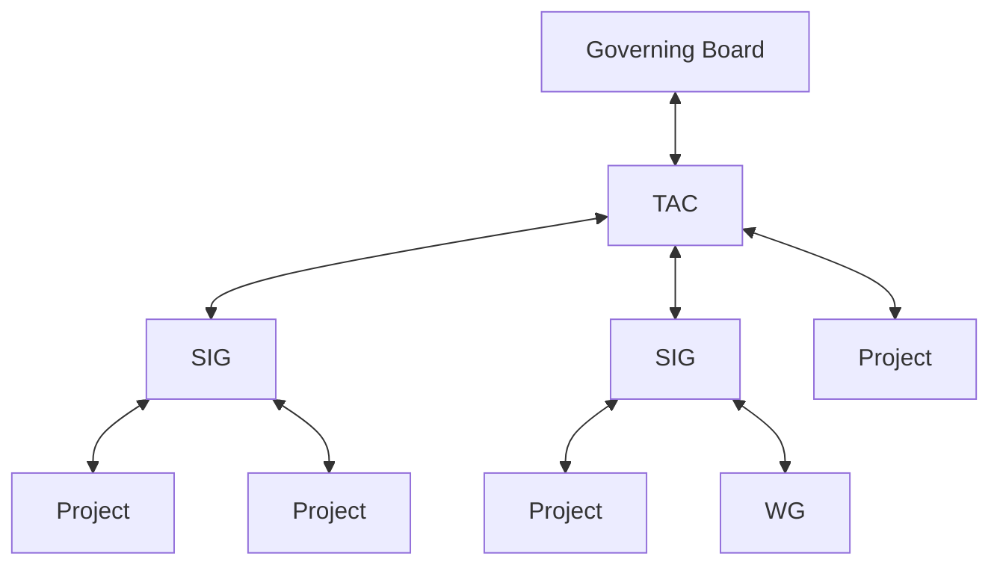

# I. Overview

This document describes the Open Source Security Foundation (OpenSSF) life cycle process for Technical Initiatives, both Special Interest Groups (SIG), Projects, and Working Groups (WG).

The authority that governs this process is as follows:

The parent organizational structure grants governance to the downward in the organizational structure.  In turn the receiving SIG, Project, or WG reports health, participation, outcomes, statuses, etc up the chain.

The process is designed to be flexible to enable a Project to move in and out of a SIG as deemed appropriate by the TAC.

# II. Lifecycle

SIGs and Projects have a different lifecycle as defined below:

* [Special Interest Group Life Cycle](sig-lifecycle.md)
* [Project Life Cycle](project-lifecycle.md)
* [Working Group Life Cycle](working-group-lifecycle.md)
