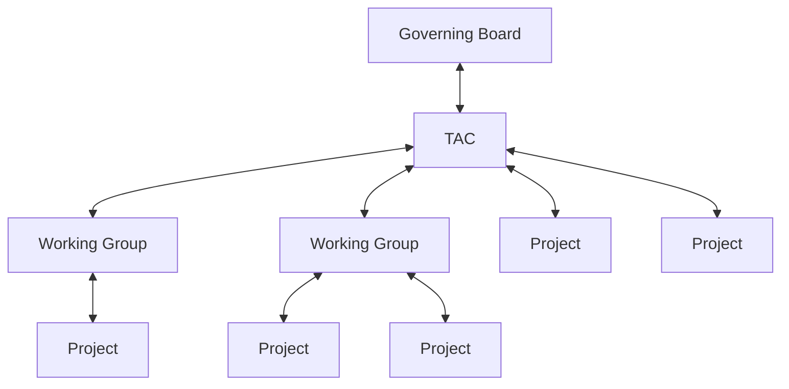

<!-- TOC -->

- [I. Overview](#i-overview)
- [II. Lifecycle](#ii-lifecycle)
    - [Stages - Definitions & Expectations](#stages---definitions--expectations)
        - [Sandbox](#sandbox)
            - [Gives - Review and Reporting](#gives---review-and-reporting)
            - [Gets - Benefits](#gets---benefits)
            - [Sandbox Entry Requirements](#sandbox-entry-requirements)
            - [Project Graduation Process: Sandbox to Incubating](#project-graduation-process-sandbox-to-incubating)
            - [Submission Forms for Sandbox](#submission-forms-for-sandbox)
            - [Submission Forms for Sandbox to Incubating](#submission-forms-for-sandbox-to-incubating)
        - [Incubating](#incubating)
            - [Gives - Review and Reporting](#gives---review-and-reporting)
            - [Gets - Benefits](#gets---benefits)
            - [Incubating Entry Requirements](#incubating-entry-requirements)
            - [Project Graduation Process: Incubating to Graduation](#project-graduation-process-incubating-to-graduation)
            - [Submission Forms for Incubating](#submission-forms-for-incubating)
            - [Submission Forms for Incubating to Graduation](#submission-forms-for-incubating-to-graduation)
        - [Graduated](#graduated)
            - [Gives - Review and Reporting](#gives---review-and-reporting)
            - [Gets - Benefits](#gets---benefits)
            - [Project Graduation Process: Graduated to Archiving](#project-graduation-process-graduated-to-archiving)
            - [Submission Forms for Graduated to Archived](#submission-forms-for-graduated-to-archived)
        - [Archived](#archived)

<!-- /TOC -->

# I. Overview

This policy describes the Open Source Security Foundation (OpenSSF) project life cycle process for Working Group to Project, adding an existing external Project as an OpenSSF Project, and transferring an existing Project from a different Linux Foundation organization, CNCF or CDF.

The authority that governs this process is as follows:

The parent organizational structure grants governance to the downward in the organizational structure.  In turn the receiving Working Group or Project report health, participation, outcomes, statuses, etc up the chain.

The process is designed to be flexible to enable a Project to move in and out of a Working Group as deemed appropriate by the TAC.

# II. Lifecycle

Each Working Group and Project will follow the sandbox, incubating, graduated and archival lifecycle stages.

The lifecycle progression, movement from one stage to another, allows them to participate at the level that is most appropriate for them given where they are at.

## Stages - Definitions & Expectations

Working Groups and Projects have a maturity level of sandbox, incubating, or graduated. Archived is for Working Groups and Projects no longer in active development. The maturity level is a signal by OpenSSF as to what sorts of enterprises should be adopting different projects. Working Groups and Projects increase their maturity by demonstrating their sustainability to OpenSSF’s Technical Advisory Committee(TAC): that they have adoption, a healthy rate of changes, committers from multiple organizations, have adopted the OpenSSF Code of Conduct, and have achieved and maintained the Core Infrastructure Initiative Best Practices Badge.

### Sandbox

The OpenSSF Sandbox is the entry point for early stage Working Groups and Projects and has four goals:

* Encourage public visibility of experiments or other early work that can add value to the OpenSSF mission and build the ingredients of a successful Incubation level Working Group or Project
* Facilitate alignment with existing Working Groups or Projects if (and only if) this is desired
* Nurture Working Groups and Projects (e.g. via OpenSSF Service Desk requests)
* Remove possible legal and governance obstacles to adoption and contribution by ensuring all projects adhere to OpenSSF legal, code of conduct and IP Policy requirements.

#### Gives - Review and Reporting

- Copyright transfer to Linux Foundation
- Trademark transfer to Linux Foundation
- Add Linux Foundation as GitHub Organization Owner
- Legal Due Diligence Documentation
- Domain Name transfer to Linux Foundation
- Meetup Member List
- CLA transfer to Linux Foundation
- Reporting required by TAC and Governing Board

#### Gets - Benefits

- Additional governance by OpenSSF Governing Board
- Oversight by OpenSSF TAC
- Access to OpenSSF Ambassador program
- Access to OpenSSF Marketing
- Access to Linux Foundation Legal
- Press Releases
- Linux Foundation Tools
  - Insights
  - EasyCLA
  - Tech Support for DNS
  - Crowdfunding
  - Bevey
- 1 Speaking slot at each OpenSSF events

#### Sandbox Entry Requirements

Working Groups and Projects being submitted to the OpenSSF at the sandbox level are intended to be the entry point for early stage projects and are not required to undergo due diligence.

Sandbox Working Groups and Projects should be early-stage projects that the OpenSSF TAC believes warrant experimentation.

* New Working Groups and Projects that are designed to extend one or more OpenSSF Projects with functionality or interoperability libraries.
* Independent projects that fit the OpenSSF mission and provide potential for a novel approach to existing functional areas (or are an attempt to meet an unfulfilled need)
* Projects commissioned or sanctioned by the OpenSSF, including initial code for OpenSSF WG collaborations, and "experimental" projects
* Any project that realistically intends to join OpenSSF Incubation in future and wishes to lay the foundations for that

#### Project Graduation Process: Sandbox to Incubating

Incubating Working Groups and Projects are required to undergo due diligence as a part of the process to move from Sandbox to Incubation. Due Diligence is driven by a TAC sponsor, with two weeks for public comment before a vote is called.

#### Submission Forms for Sandbox

1. [Proposal](TBD)
2. [Legal](TBD)

#### Submission Forms for Sandbox to Incubating

1. [Proposal](TBD)
2. [Legal](TBD)

### Incubating

#### Gives - Review and Reporting

- Copyright transfer to Linux Foundation
- Trademark transfer to Linux Foundation
- Add Linux Foundation as GitHub Organization Owner
- Legal Due Diligence Documentation
- Domain Name transfer to Linux Foundation
- Meetup Member List
- CLA transfer to Linux Foundation
- Reporting required by TAC and Governing Board
- Security Audit by 3rd Party to Graduate

#### Gets - Benefits

- Additional governance by OpenSSF Governing Board
- Oversight by OpenSSF TAC
- Access to OpenSSF Ambassador program
- Access to OpenSSF Marketing
- Access to Linux Foundation Legal
- Press Releases
- Linux Foundation Tools
  - Insights
  - EasyCLA
  - Tech Support for DNS
  - Crowdfunding
  - Bevey
- **2 Speaking slots at each OpenSSF events**
- **Funding for Infrastructure**  

#### Incubating Entry Requirements

To be accepted to incubating stage, a project must meet the sandbox stage requirements plus:

* Document that it is being used successfully in production by at least three independent end users which, in the TAC’s judgement, are of adequate quality and scope.
* Have a healthy number of committers. A committer is defined as someone with the commit bit; i.e., someone who can accept contributions to some or all of the project.
* Demonstrate a substantial ongoing flow of commits and merged contributions.
* Since these metrics can vary significantly depending on the type, scope and size of a project, the TAC has final judgement over the level of activity that is adequate to meet these criteria
* A clear versioning scheme.
* Specifications must have at least one public reference implementation.

#### Project Graduation Process: Incubating to Graduation

Projects that wish to move from Incubating to Graduation should open a PR confirming the following criteria:
* Have committers from at least two organizations.
* Have achieved and maintained a [Core Infrastructure Initiative Best Practices Badge](https://bestpractices.coreinfrastructure.org/).
* Have completed an independent and third party security audit with results published of similar scope and quality as [this example](https://github.com/envoyproxy/envoy#security-audit) which includes all critical vulnerabilities and all critical vulnerabilities need to be addressed before graduation.
* Explicitly define a project governance and committer process. This preferably is laid out in a GOVERNANCE.md file and references an OWNERS.md file showing the current and emeritus committers.
* Have a public list of project adopters for at least the primary repo (e.g., ADOPTERS.md or logos on the project website). For a specification, have a list of adopters for the implementation(s) of the spec.
* Please include a short one-page narrative based off the Graduation template, no more than 500 words.

#### Submission Forms for Incubating

1. [Proposal](TBD)
2. [Legal](TBD)

#### Submission Forms for Incubating to Graduation

1. [Proposal](TBD)
2. [Legal](TBD)

### Graduated

Graduated projects signal the highest level of maturity for a OpenSSF project.

#### Gives - Review and Reporting

- Copyright transfer to Linux Foundation
- Trademark transfer to Linux Foundation
- Add Linux Foundation as GitHub Organization Owner
- Legal Due Diligence Documentation
- Domain Name transfer to Linux Foundation
- Meetup Member List
- CLA transfer to Linux Foundation
- Reporting required by TAC and Governing Board

#### Gets - Benefits

- Additional governance by OpenSSF Governing Board
- Oversight by OpenSSF TAC
- Access to OpenSSF Ambassador program
- Access to OpenSSF Marketing
- Access to Linux Foundation Legal
- Press Releases
- Linux Foundation Tools
  - Insights
  - EasyCLA
  - Tech Support for DNS
  - Crowdfunding
  - Bevey
- **Day 0 track at each OpenSSF event**
- **Funding for Infrastructure**  
- **Funding for Development** 

#### Project Graduation Process: Graduated to Archiving

Open source projects have a lifecycle and there are times that projects become inactive due to a variety of reasons. There are also cases where a project may no longer want to be supported by the TAC, or the TAC may no longer wish to recommend the use of a project.
Archiving Criteria
When voting on a proposal to archive a project, TAC members may wish to consider whether the project continues to meet the criteria for OpenSSF acceptance. The TAC may also look at activity levels in the project (https://all.devstats.cncf.io/d/53/projects-health-table?orgId=1), although it is important to note that there is a difference between a mature project that doesn't get much attention any more but is stable, versus a project that is inactive.

#### Submission Forms for Graduated to Archived

1. [Proposal](TBD)
2. [Legal](TBD)

### Archived

Archived projects are no longer in active development and are only archived after a TAC vote.

What does archiving for a OpenSSF project mean?
* OpenSSF will no longer provide support for the project via service desk
* OpenSSF will list archived projects online
* Trademarks and domain names of archived projects are still hosted by the OpenSSF and the Linux Foundation
* OpenSSF can provide services such as documentation updates to help transition users.
* Other OpenSSF marketing activities will no longer be provided for the project

To archive a project:
* A proposal must be put forth to the TAC repo
* The TAC will inform the project maintainers, OpenSSF end user community and wider community of all archiving proposals
* The proposal must remain open for at least 2 weeks of discussion after the maintainers are informed.
* A vote must be finalized with 2/3 approval from the TAC

