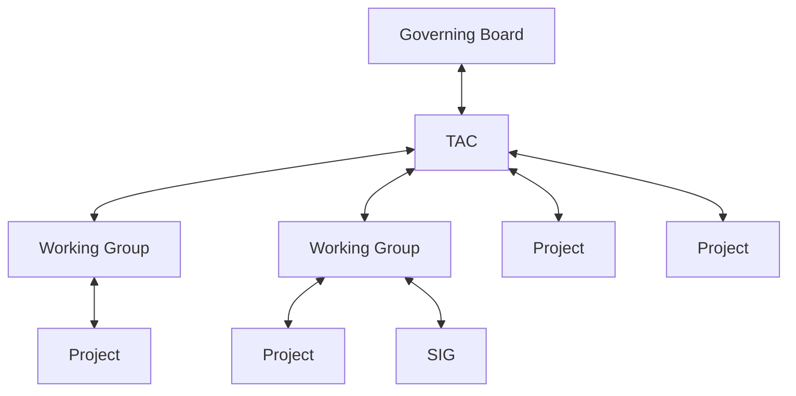

# I. Overview

This document describes the Open Source Security Foundation (OpenSSF) life cycle process for Technical Initiatives, inclusive of Working Groups, Projects, and Special Interest Groups (SIG).

The authority that governs this process is as follows:

The parent organizational structure grants governance to the downward in the organizational structure.  In turn the receiving Working Group, Project, or SIG reports health, participation, outcomes, statuses, etc up the chain.

The process is designed to be flexible to enable a Project to move in and out of a Working Group as deemed appropriate by the TAC.

# II. Lifecycle

Technical Initiatives (TIs) include Working Groups (WGs), Special Interest Groups (SIGs) and Projects (both code and specificiations). All TIs follow a common lifecyle, with 4 stages: 

- Sandbox - for new efforts within the Foundation seeking to get started out within a community of like-minded contributors
- Incubating - for more mature and organized groups that have participated in the community for some period of time
- Graduated - for mature efforts that have a proven track-record of deliverables and adding value to the community
- Archived - for groups that either are feature-complete and retired, or that no longer has active contributions occurring

Each TI will haved equivellent, but slightly different requirements and benefits, depending on their stage in the lifecyle and are defined below:

* [Working Group Life Cycle](working-group-lifecycle.md)
* [Project Life Cycle](project-lifecycle.md)
* [Special Interest Group Life Cycle](sig-lifecycle.md)
