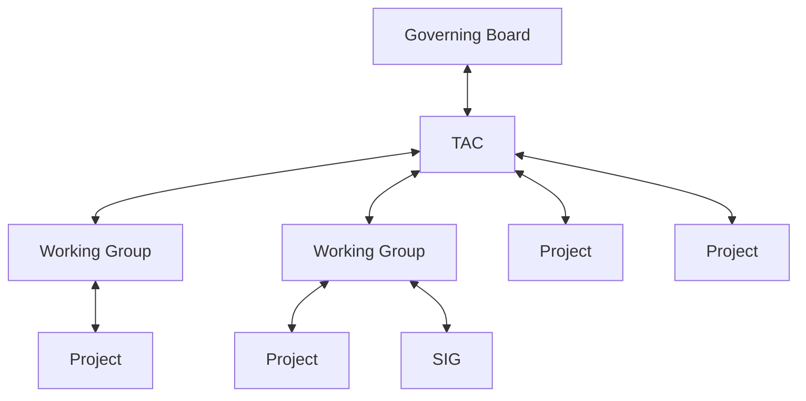

# I. Overview

This document describes the Open Source Security Foundation (OpenSSF) life cycle process for Technical Initiatives, inclusive of Working Groups, Projects, and Special Interest Groups (SIG).

The authority that governs this process is as follows:

The parent organizational structure grants governance to the downward in the organizational structure.  In turn the receiving Working Group, Project, or SIG reports health, participation, outcomes, statuses, etc up the chain.

The process is designed to be flexible to enable a Project to move in and out of a Working Group as deemed appropriate by the TAC.

# II. Lifecycle

Working Groups and Projects have a different lifecycle as defined below:

* [Working Group Life Cycle](working-group-lifecycle.md)
* [Project Life Cycle](project-lifecycle.md)
* [Special Interest Group Life Cycle](sig-lifecycle.md)
