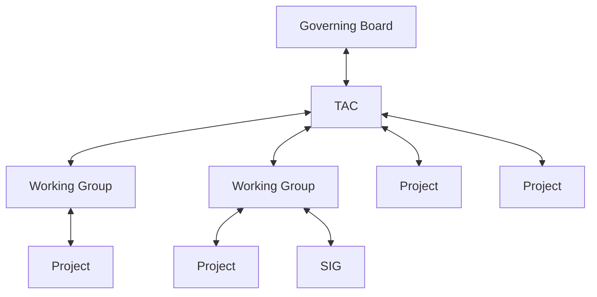
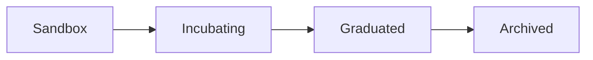

# I. Overview

This document describes the Open Source Security Foundation (OpenSSF) lifecycle process for Technical Initiatives (TI) which include Working Groups (WG), Projects (developing code or specifications), and Special Interest Groups (SIG).

The authority that governs this process is as follows:

The parent organizational structure grants governance to the downward entity in the organizational structure.  In turn the receiving Working Group, Project, or SIG reports health, participation, outcomes, statuses, etc up the chain.

The process is designed to be flexible to enable a Project to move in and out of a Working Group as deemed appropriate by the TAC.

# II. Lifecycle

All Technical Initiatives follow a common lifecycle, with 4 stages: 

- Sandbox - for new efforts within the Foundation seeking to get started out within a community of like-minded contributors
- Incubating - for more mature and organized groups that have participated in the community for some period of time
- Graduated - for mature efforts that have a proven track-record of deliverables and adding value to the community
- Archived - for groups that either are feature-complete and retired, or that no longer has active contributions occurring

Each type of TI has equivalent, but slightly different requirements and benefits, depending on their stage in the lifecycle as defined below:

* [Working Group Life Cycle](working-group-lifecycle.md)
* [Project Life Cycle](project-lifecycle.md)
* [Special Interest Group Life Cycle](sig-lifecycle.md)

To see what the expected requirements ("Gives") and benefits ("Gets") for a TI to achieve at a given lifecycle stage, refer to the [TI Gives and Gets](https://github.com/ossf/tac/blob/main/process/TI-Gives%2BGets.md) page for more information.  Each lifecycle stage has listed what they must do or produce and a list of benefits for each level of maturity in our proceeses.
