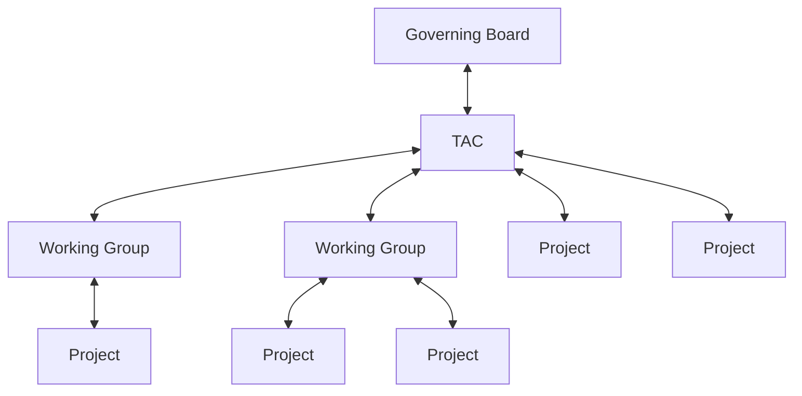

# I. Overview

This document describes the Open Source Security Foundation (OpenSSF) life cycle process for Technical Initiatives, both Working Groups and Projects.

The authority that governs this process is as follows:

The parent organizational structure grants governance to the downward in the organizational structure.  In turn the receiving Working Group or Project report health, participation, outcomes, statuses, etc up the chain.

The process is designed to be flexible to enable a Project to move in and out of a Working Group as deemed appropriate by the TAC.

# II. Lifecycle

There are two different types of projects within OpenSSF: software focused projects and non-software focused projects. As the names imply, the primary goal of software-focused projects is to develop a piece of software while the primary goal of non-software focused projects is not. The primary goal of non-software projects can be to develop a guide, some educational material, or conduct an outreach operation for instance.

Working Groups, software focused projects, and non-software focused projects have different lifecycles as defined below:

* [Working Group Life Cycle](working-group-lifecycle.md)
* [Software focused project Life Cycle](software-project-lifecycle.md)
* [Non-software focused project Life Cycle](non-software-project-lifecycle.md)

